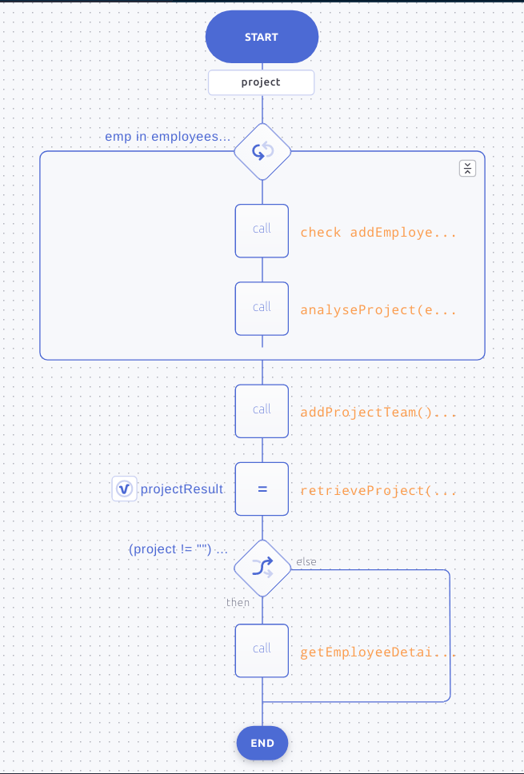

# Employee-App

A Ballerina app that interacts with a MySQL database to handle employee details.

### Overview
This package connects to a MySQL database and updates a list of employees through the configurations. 
Using that details, it filters the details of employees who are working on a given project and prints those details. 

The database information and the employee details can be configured through `Config.toml` in the following format.

```toml
[EmployeeApp.dbConnector.database]
port = <PORT>
name = "<DB_NAME>"

[EmployeeApp.dbConnector]
username = "<USER_NAME>"
password = "<PASSWORD>"

[[employees]]
emp_id = 123
name = "John Doe"
salary = 10000.0
position = "Software Engineer"
projects = ["module1"]
```

The `position` field of an employee is represented using Ballerina Enumerations. Therefore, the supported values are, 

```
    "Software Engineer",
    "Project Manager",
    "Tech Lead"
```

The flow diagram of the EmployeeApp can be shown as below,



### How to run the App

To print the employee details from a specific project, we need to provide the project name as a command-line argument.

Eg. If the project name is `DBMS_module`,
```
bal run -- DBMS_module
```
The output will be,

```

Compiling source
        hinduja/EmployeeApp:0.1.0

Running executable

Connected to database!
{"time":"2021-06-04T09:58:56.828+05:30", "level":"INFO", "module":"hinduja/EmployeeApp", "message":"Employees who worked in project : ", "project":"DBMS_module"}
{"emp_id":101,"name":"Jack","position":"Software Engineer"}
{"emp_id":102,"name":"John","position":"Tech Lead"}
{"emp_id":103,"name":"Jill","position":"Project Manager"}
```
The database related details can be found at module [dbConnector](modules/dbConnector/Package.md).
