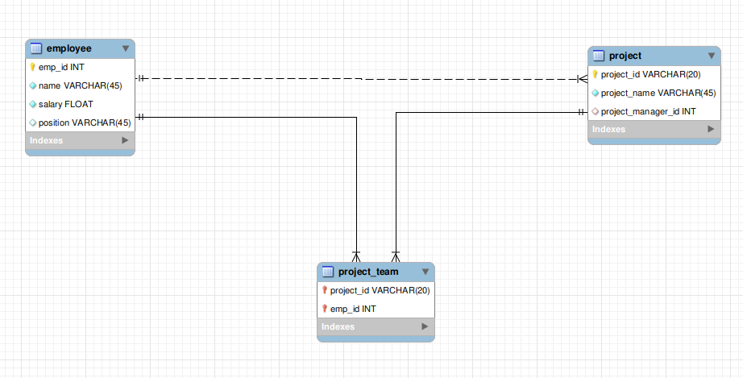

Connects to a MySQL database and update employee details.

# Overview
This package connects to a MySQL database and populates a table with the details of employees and their projects.

The database details can be configured through the configuration file `Config.toml` in the following format.

```toml
[EmployeeApp.dbConnector]
username = "<USER_NAME>"
password = "<PASSWORD>"

[EmployeeApp.dbConnector.database]
host = "<DATABASE_HOST>"
port = <DATABASE_PORT>
name = "<DATABASE_NAME>"

```


The database can be constructed with following script, 

```sql
CREATE DATABASE `employee`;
USE `employee`;

CREATE TABLE IF NOT EXISTS `Employee`.`employee` (
  `emp_id` INT NOT NULL,
  `name` VARCHAR(45) NOT NULL,
  `salary` FLOAT NOT NULL,
  `position` VARCHAR(45) NULL DEFAULT NULL,
  PRIMARY KEY (`emp_id`)
);

CREATE TABLE IF NOT EXISTS `Employee`.`project` (
  `project_id` VARCHAR(20) NOT NULL,
  `project_name` VARCHAR(45) NOT NULL,
  `project_manager_id` INT NULL DEFAULT NULL,
  PRIMARY KEY (`project_id`),
  INDEX `fk_project_1_idx` (`project_manager_id` ASC) VISIBLE,
  CONSTRAINT `fk_project_1`
    FOREIGN KEY (`project_manager_id`)
    REFERENCES `Employee`.`employee` (`emp_id`)
);

CREATE TABLE IF NOT EXISTS `Employee`.`project_team` (
  `project_id` VARCHAR(20) NOT NULL,
  `emp_id` INT NOT NULL,
  PRIMARY KEY (`project_id`, `emp_id`),
  INDEX `fk_project_team_1_idx` (`emp_id` ASC) VISIBLE,
  CONSTRAINT `fk_project_team_1`
    FOREIGN KEY (`emp_id`)
    REFERENCES `Employee`.`employee` (`emp_id`),
  CONSTRAINT `fk_project_team_2`
    FOREIGN KEY (`project_id`)
    REFERENCES `Employee`.`project` (`project_id`)
);
```

The EER diagram can be shown as, 


